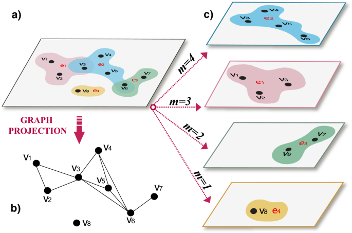

# Research Trend Forecasting with Temporal Hypergraphs

A research trend forecasting system that combines **temporal hypergraph neural networks** with **frequent itemset mining** to predict emerging trends in computer science research.

The system analyzes **3,731 research papers**, **5,974 extracted keywords**, and **28 semantic research topics** across data spanning 2015–2025. Rather than relying on a single forecasting method, the project approaches research trends at two complementary levels:

* **Topic-level forecasting** using a temporal hypergraph neural network.
* **Keyword-level trend discovery** using frequent itemset mining and residual-based forecasting.

The resulting pipeline identifies both **which research areas are likely to grow** and **which combinations of ideas are driving that growth**.

## Hypergraph Representation

Research papers naturally contain relationships that extend beyond pairwise connections. A single paper may simultaneously connect multiple topics, keywords, and research concepts.

We therefore represent the research corpus as a **hypergraph**, where a hyperedge can connect multiple related entities at once.



This representation allows the model to capture higher-order relationships between research topics that would be lost in a conventional pairwise graph.

## System Overview

The forecasting pipeline contains two independent but complementary paths:

```text
                    Research Papers
                         │
              ┌──────────┴──────────┐
              │                     │
        Topic Assignment      Keyword Extraction
              │                     │
              ▼                     ▼
     Temporal Hypergraph      Frequent Itemsets
              │                     │
          GRU Encoder          Trend Residuals
              │                     │
              ▼                     ▼
       Topic Forecasts       Keyword Forecasts
              │                     │
              └──────────┬──────────┘
                         ▼
                Combined Forecast
```

### 1. Temporal Hypergraph Neural Network

The first forecasting method models the evolution of research topics over time.

Yearly hypergraph snapshots are constructed from the research corpus and processed using a **GRU-based temporal encoder**. The model learns how topic relationships and activity evolve across time and forecasts future topic activity.

The model is trained on 2020–2024 data and evaluated against observed 2025 research activity before producing forecasts for 2026.

### 2. Frequent Itemset Mining

Topic forecasts reveal broad research directions, but they can hide smaller emerging combinations of ideas.

The second pipeline therefore operates directly on extracted keywords.

Frequent keyword pairs and triples are identified using support and lift constraints. Their temporal behavior is compared against a historical drift baseline, allowing the system to detect combinations whose growth is accelerating faster than expected.

This provides a finer-grained view of emerging research directions.

## Results

### 2026 Topic Forecasts

| Rank | Topic                       | Predicted Papers |
| ---: | --------------------------- | ---------------: |
|    1 | Machine Learning            |            232.9 |
|    2 | Deep Learning               |            129.2 |
|    3 | Natural Language Processing |            101.8 |
|    4 | Software Engineering        |             66.8 |
|    5 | Computer Vision             |             57.9 |

### Emerging Keyword Combinations

| Rank | Keyword Combination               | Forecast Residual |
| ---: | --------------------------------- | ----------------: |
|    1 | reasoning + reinforcement         |          +0.00581 |
|    2 | query + query optimization        |          +0.00448 |
|    3 | remote + remote sensing + sensing |          +0.00359 |
|    4 | remote sensing + sensing          |          +0.00359 |
|    5 | software + software engineering   |          +0.00359 |

Positive residuals indicate that a keyword combination is growing **faster than expected under its historical trend**.

Notably, the two independent forecasting methods identify overlapping signals around **reasoning, reinforcement learning, and software engineering**, providing additional evidence that these areas are experiencing increasing research activity.

## Model Evaluation

The temporal hypergraph model was trained using data from 2020–2024 and evaluated against 2025 ground truth.

| Metric           |     Result |
| ---------------- | ---------: |
| Precision@5      |  **1.000** |
| Precision@10     |  **1.000** |
| NDCG@10          | **0.9865** |
| Topics Evaluated |         28 |

The itemset pipeline identified:

* **127 frequent keyword pairs**
* **29 frequent keyword triples**
* Minimum support: **1%**
* Minimum lift: **1.5**

These two methods measure different aspects of the research landscape. The neural model forecasts **macro-level topic activity**, while itemset mining identifies **micro-level combinations of concepts exhibiting unexpected growth**.

## Dataset

The complete pipeline operates over:

| Property           |     Value |
| ------------------ | --------: |
| Research Papers    |     3,731 |
| Extracted Keywords |     5,974 |
| Semantic Topics    |        28 |
| Data Coverage      | 2015–2025 |
| Forecast Year      |      2026 |

Keywords are extracted using **TF-IDF**, while papers are assigned to one of 28 semantic research topics.

## Project Structure

```text
cof_hypergraph/
│
├── temporal_hypergraph_nn.py
│   └── Temporal hypergraph training and forecasting
│
├── keyword_topic_transparency.py
│   └── Keyword extraction and topic scoring
│
├── prediction_interpretability.py
│   └── Connects GNN predictions with influential keywords
│
├── keyword_itemset_mining.py
│   └── Frequent itemset mining and trend forecasting
│
├── compare_gnn_vs_itemset.py
│   └── Cross-method comparison and overlap analysis
│
├── generate_combined_forecast.py
│   └── Generates unified forecast output
│
├── combined_forecast_output/
│   └── forecast_2026_combined.json
│
├── prediction_interpretability_output/
├── keyword_itemset_output/
├── comparison_output/
│
└── assets/
    └── hypergraph.png
```

## Output

The primary machine-readable result is:

```text
combined_forecast_output/forecast_2026_combined.json
```

It contains predictions from both forecasting methods, overlap analysis, influential keywords, and associated metadata.

Example usage:

```python
import json

with open("combined_forecast_output/forecast_2026_combined.json") as f:
    forecast = json.load(f)

topics = forecast["gnn_predictions"]["top_predictions"]
itemsets = forecast["itemset_predictions"]["top_predictions"]
overlap = forecast["keyword_analysis"]["overlap"]
```

The combined output is designed to support downstream dashboards, APIs, visualization systems, or additional research analysis.

## Why Hypergraphs?

Traditional graphs represent relationships as pairwise edges:

```text
A ── B
```

Research papers, however, often connect several concepts simultaneously:

```text
{Graph Neural Networks,
 Anomaly Detection,
 Fraud Detection,
 Explainability}
```

Representing this relationship as several independent edges discards information about the fact that these concepts appeared **together within the same research context**.

A hypergraph instead represents the entire relationship as a single hyperedge:

```text
e = {GNN, Anomaly Detection, Fraud Detection, Explainability}
```

This makes hypergraphs particularly useful for modeling scientific literature, where papers frequently connect multiple topics and concepts simultaneously.

## Future Work

Several extensions could improve the forecasting system:

* Incorporating citation-network dynamics into the temporal representation.
* Comparing GRU-based forecasting against transformer-based temporal encoders.
* Expanding itemset forecasting beyond triples.
* Evaluating alternative time-series baselines such as ARIMA or learned forecasting models.
* Incorporating publication venues, authors, and institutions into the hypergraph.
* Updating forecasts continuously as new papers become available.
* Developing uncertainty estimates around future topic activity.

## Research Goal

The broader goal of this project is to investigate whether the **structure and evolution of scientific knowledge can provide predictive signals about future research activity**.

Rather than treating scientific papers as independent documents, the system models research as an evolving network of interacting topics and concepts. Combining learned hypergraph representations with interpretable keyword-level trend mining provides both predictive capability and a mechanism for understanding *why* particular research areas appear to be emerging.
